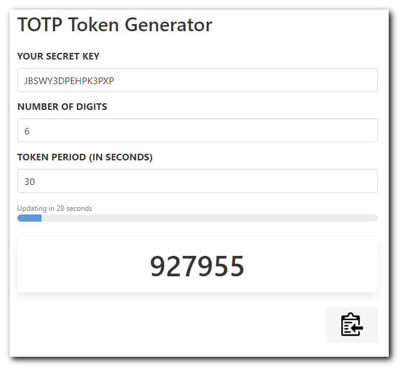

# Generate time-based one time passwords in the browser

[Creator](https://www.facebook.com/imArifulhaquechowdhury/)

This page lets you easily generate a time-based one time password (TOTP) entirely in the web browser in case you ever lose access to your phone.

It uses the excellent [otpauth](https://github.com/hectorm/otpauth) package, downloaded from [raw.githubusercontent.com/hectorm/otpauth/master/dist/otpauth.umd.min.js](https://raw.githubusercontent.com/hectorm/otpauth/master/dist/otpauth.umd.min.js).

## Providing parameters in the URL

### Private key

You can provide the key in the URL using the URI fragment or a query parameter, for example: `https://totp.danhersam.com/#/KEY` or `https://totp.danhersam.com?key=KEY`

### Additional parameters

You can also pass the token digits, period and algorithm using a query string in the URL, for example: `https://totp.danhersam.com/?digits=6&period=60&algorithm=SHA256&key=KEY`

See [supported hashing algorithms](https://github.com/hectorm/otpauth#supported-hashing-algorithms) for the complete list.

